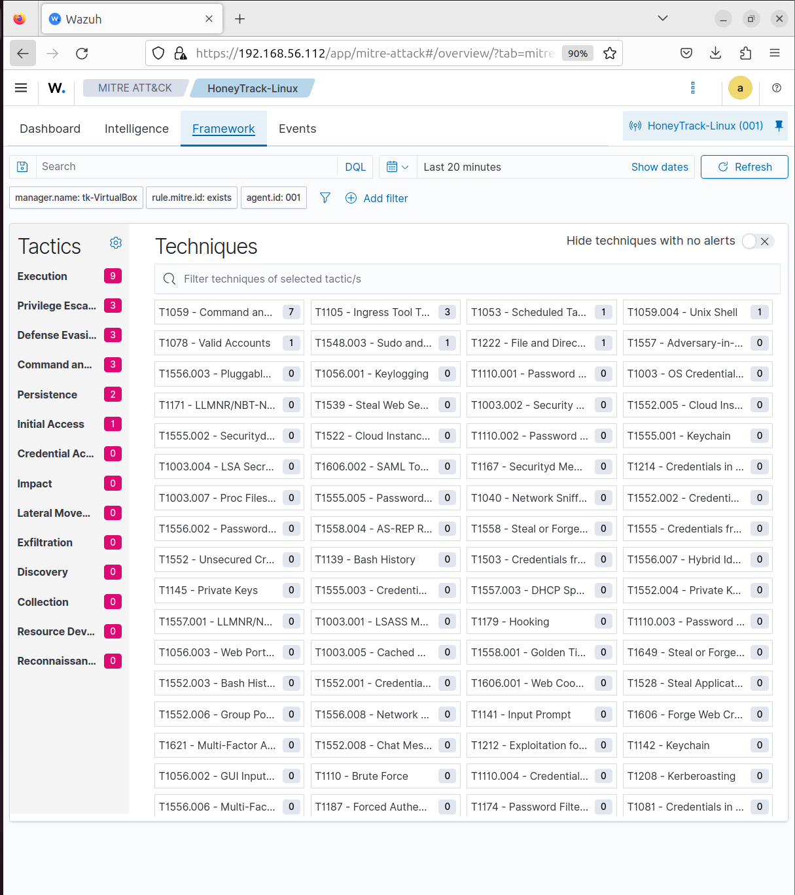
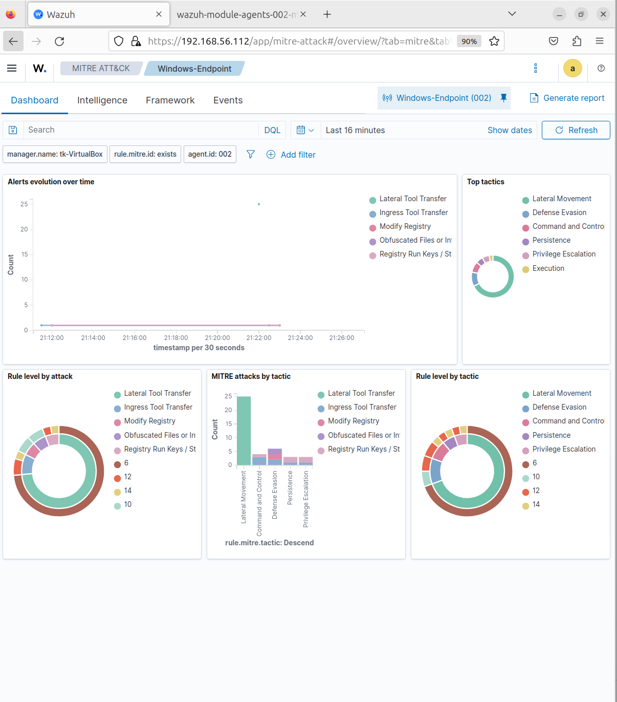
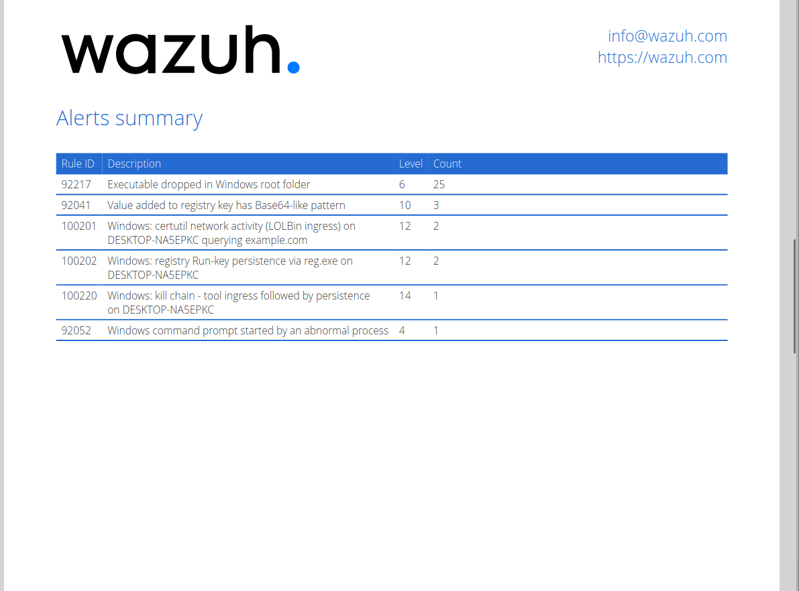
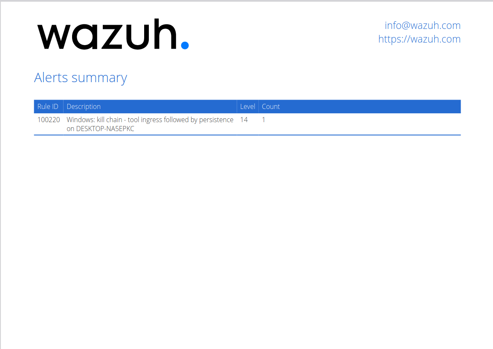

# Detection Lab

**A Wazuh SIEM lab with custom detection rules across a Linux and a Windows endpoint — turning raw endpoint activity into severity-rated, MITRE ATT&CK-mapped alerts, including correlation rules that detect multi-step attack sequences on each platform.**

The Linux side is the blue-team counterpart to [HoneyTrack](https://github.com/Tauqeerkhan187/HoneyTrack), my custom SSH/Telnet honeypot: HoneyTrack captures attacker behaviour, this lab detects it. The Windows side extends the same approach to Sysmon telemetry — the environment most SOCs actually monitor. One honeypot generates the attacks; the detection engineering catches them on both platforms.






---

## Why I built it

Deploying a SIEM is configuration. *Writing detections* is engineering. I wanted a project that demonstrated the second one — taking real endpoint activity and building the rules, severity model, and correlation logic a SOC analyst would rely on — across both a Linux and a Windows host.

The honeypot gave me a live source of genuine attacker behaviour to build the Linux detections against. The Windows endpoint let me detect the techniques a real workstation faces — encoded PowerShell, LOLBins, registry persistence — from Sysmon telemetry.

---

## Key features

- **Two monitored endpoints** — a Linux host (honeypot telemetry) and a Windows host (Sysmon telemetry), each with its own custom rule set and kill-chain correlation
- **18 custom detection rules total** (14 Linux + 4 Windows), each mapped to a MITRE ATT&CK technique
- **Correlation rules on both platforms** — a payload download followed by persistence from the same source raises a single high-severity alert describing the compromise, rather than two disconnected events
- **A severity model that mirrors the attack lifecycle** — recon and single techniques graded below correlated compromise sequences
- **Custom rules layered on the built-in ruleset, not duplicating it** — detections add ATT&CK-mapped severity where the built-ins are weak, and correlate across events the built-ins treat in isolation
- **Every rule verified** — validated with `wazuh-logtest` and confirmed firing live in the dashboard

---

## Architecture

```
   [ Attacker ]                          [ Attacker techniques ]
        │  SSH / Telnet                         │  (encoded PS, certutil, reg)
        ▼                                       ▼
┌──────────────────────┐              ┌──────────────────────┐
│  HoneyTrack honeypot  │              │   Windows 11 host     │
│  (Linux endpoint)     │              │   + Sysmon            │
└──────────┬───────────┘              └──────────┬───────────┘
           │ events.jsonl                        │ Sysmon eventchannel
           ▼                                      ▼
┌──────────────────────┐              ┌──────────────────────┐
│    Wazuh agent        │              │    Wazuh agent        │
└──────────┬───────────┘              └──────────┬───────────┘
           │                                      │
           │            1514/tcp                  │
           └──────────────┬───────────────────────┘
                          ▼
        ┌──────────────────────────────────────────┐
        │              Wazuh manager                │
        │  JSON + eventchannel decoders             │
        │  → custom rules → alerts                  │
        │    Linux: local_rules.xml (14)            │
        │    Windows: sysmon rules (4)              │
        └──────────────────┬───────────────────────┘
                           ▼
        ┌──────────────────────────────────────────┐
        │    Wazuh dashboard                        │
        │    Threat Hunting · MITRE ATT&CK          │
        └──────────────────────────────────────────┘
```

---

## Detection catalog

Two platforms, documented separately:

- **[Linux / honeypot detections](docs/detection-catalog.md)** — 14 rules against HoneyTrack telemetry
- **[Windows / Sysmon detections](docs/windows-detection-catalog.md)** — 4 rules against Sysmon telemetry

### Linux (honeypot)

| Rule | Detects | ATT&CK | Level |
|------|---------|--------|-------|
| 100101 | Honeypot session opened | T1078 | 5 |
| 100102 | Credential attempt captured | T1110 | 6 |
| 100103 | Command executed | T1059 | 5 |
| 100104 | Ingress tool transfer (wget/curl) | T1105 | 10 |
| 100105 | File dropped | T1105 | 9 |
| 100106 | File permission modification | T1222 | 8 |
| 100107 | Persistence attempt (cron) | T1053 | 12 |
| 100108 | Privilege escalation via sudo | T1548.003 | 8 |
| 100109 | Interpreter execution | T1059.004 | 9 |
| 100110 | Session closed | — | 3 |
| **100120** | **Brute force** — 5 attempts in 2 min | T1110 | 10 |
| **100121** | **Scripted attacker** — 10 commands in 60 s | T1059 | 10 |
| **100122** | **Kill chain** — download → persistence | T1105, T1053 | 13 |


*(100100 is the base rule all honeypot rules inherit from.)*

### Windows (Sysmon)

| Rule | Detects | ATT&CK | Level |
|------|---------|--------|-------|
| 100200 | Obfuscated PowerShell | T1059.001, T1027 | 12 |
| 100201 | certutil LOLBin ingress | T1105, T1218 | 12 |
| 100202 | Registry Run-key persistence | T1547.001 | 12 |
| **100220** | **Kill chain** — ingress → persistence | T1105, T1547.001 | 14 |

The bolded rules on both platforms are correlations. They deliberately outrank the individual steps they're built from: a sequence is more meaningful than any single event within it.



---

## The correlation rules

Both endpoints answer the same question — *are these separate alerts actually one attack?* — with the same mechanism (`if_matched_sid` + `same_field`), adapted to each platform's telemetry.

**Linux** (`100122`): a `wget`/`curl` download followed by a cron persistence attempt from the same source IP → one level-13 alert carrying T1105 + T1053 across four tactics.

**Windows** (`100220`): a certutil download followed by a registry Run-key write on the same host → one level-14 alert carrying T1105 + T1547.001.



In both cases the correlated alert supersedes the individual persistence alert rather than duplicating it — one alert describing a compromise, instead of two events an analyst has to join by hand.

---

## How it works

**Ingestion.** The Linux endpoint ships honeypot events as JSON (`events.jsonl`) over an `<log_format>json</log_format>` localfile. The Windows endpoint ships the `Microsoft-Windows-Sysmon/Operational` channel via an `eventchannel` localfile. Both decode into individually queryable fields — no custom decoder needed.

**Rule structure.** Linux rules inherit from a base rule via `<if_sid>` and match on the honeypot's `event` field. Windows rules either fire standalone on Sysmon events or chain off Wazuh's built-in Sysmon rules to escalate them with ATT&CK context.

**Correlation.** `if_matched_sid` + `timeframe` match against previously-seen events, with `<same_field>` grouping them by attacker (source IP on Linux, hostname on Windows).

A field-naming note that cost some debugging: inside the rule engine, decoded Windows eventchannel fields are `win.eventdata.*` / `win.system.*`, **not** `data.win.*` — the `data.` prefix seen in the dashboard's Discover view is display-only.

---

## Lab setup

| Component | Details |
|-----------|---------|
| SIEM | Wazuh 4.14 all-in-one (indexer + manager + dashboard) |
| SIEM host | Ubuntu Server 24.04, 4 vCPU, 6 GB RAM, headless |
| Linux endpoint | Ubuntu VM running HoneyTrack + Wazuh agent |
| Windows endpoint | Windows 11 + Sysmon (SwiftOnSecurity config) + Wazuh agent |
| Network | VirtualBox host-only (isolated) + NAT for updates |

### Reproducing it

```bash
# On the SIEM host
curl -sO https://packages.wazuh.com/4.14/wazuh-install.sh
sudo bash ./wazuh-install.sh -a
```

Deploy the rules — on the live manager, all custom rules live in a single file
(`/var/ossec/etc/rules/local_rules.xml`). In this repo they're split by platform
(`rules/local_rules.xml` for Linux, `rules/windows_rules.xml` for Windows) for
readability; concatenate them into the manager's file, or paste both rule groups
in:

```bash
sudo systemctl restart wazuh-manager
```

Each endpoint runs a Wazuh agent with the relevant localfile (honeypot JSON on
Linux, the Sysmon eventchannel on Windows — see `config/`).

Validate any rule before trusting it:

```bash
sudo /var/ossec/bin/wazuh-logtest
# paste a sample event from samples/
```

---

## Scope and limitations

This lab runs in an **isolated VirtualBox environment**. Linux attacks are generated against my own honeypot; Windows techniques are run by hand against the endpoint. That was deliberate — exposing a honeypot publicly is a serious hardening job, and I scoped the project to demonstrate detection engineering without carrying that risk.

Consequences worth naming: attacker IPs are private, so IOC enrichment and geolocation return nothing; and detections are tuned to this environment (e.g. the Windows rules key off the SwiftOnSecurity Sysmon config's specific behaviour). On a hardened public deployment those fields would populate and the same rules would apply.

---

## Roadmap

- [ ] Detection tuning with Atomic Red Team
- [ ] Sigma versions of each rule for portability across SIEMs
- [ ] Windows lateral-movement and credential-access detections
- [ ] Alerting integrations (email / webhook) for level 12+

---

## Related

- [HoneyTrack](https://github.com/Tauqeerkhan187/HoneyTrack) — the custom SSH/Telnet honeypot producing the Linux telemetry this lab detects against.

## License

MIT
