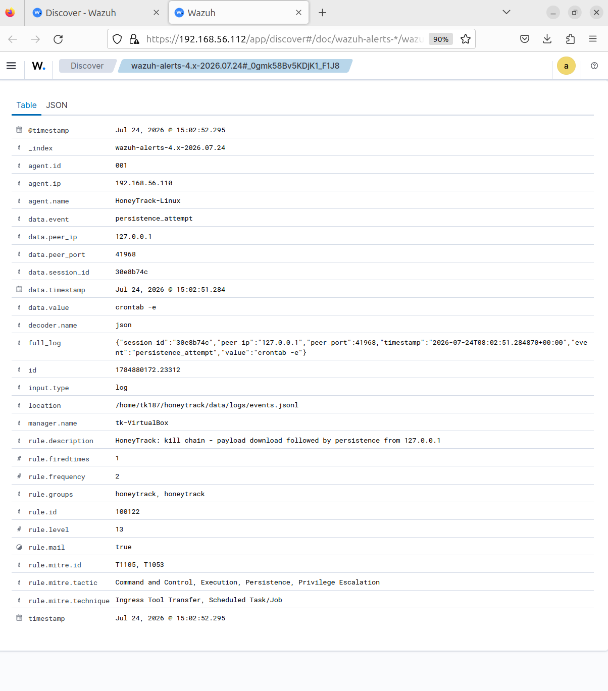

# Detection Lab

**A Wazuh SIEM lab with custom detection rules that turn raw honeypot activity into severity-rated, MITRE ATT&CK-mapped alerts — including correlation rules that detect multi-step attack sequences, not just individual events.**

This is the blue-team counterpart to [HoneyTrack](https://github.com/Tauqeerkhan187/HoneyTrack), my custom SSH/Telnet honeypot. HoneyTrack captures attacker behaviour; this lab detects it. Together they close the loop: attack generation on one side, detection engineering on the other.


---

## Why I built it

Deploying a SIEM is configuration. *Writing detections* is engineering. I wanted a project that demonstrated the second one — taking a real stream of attacker activity and building the rules, severity model, and correlation logic a SOC analyst would actually rely on.

The honeypot gave me a live source of genuine attacker behaviour to build against, which meant every rule could be tested against real captured events rather than invented samples.

---

## Key features

- **14 custom detection rules** covering every event type the honeypot emits, each mapped to a MITRE ATT&CK technique
- **Correlation rules** that detect *sequences* — a payload download followed by persistence from the same source raises a single high-severity alert describing the compromise, rather than two disconnected events
- **A severity model that mirrors the attack lifecycle** — reconnaissance at level 3–5, staging at 8–9, ingress at 10, persistence at 12, and a correlated kill chain at 13
- **End-to-end log pipeline** — honeypot JSON is shipped by a Wazuh agent, decoded into queryable fields, and matched by rules with no custom decoder required
- **Verified detections** — every rule validated with `wazuh-logtest` before deployment, then confirmed firing live in the dashboard

---

## Architecture

```
   [ Attacker ]
        │  SSH / Telnet
        ▼
┌──────────────────────────┐
│   HoneyTrack honeypot     │   captures session, writes JSON events
│   (separate project)      │
└────────────┬─────────────┘
             │  data/logs/events.jsonl
             ▼
┌──────────────────────────┐
│      Wazuh agent          │   ships events over 1514/tcp
│      (Linux endpoint)     │
└────────────┬─────────────┘
             │
             ▼
┌──────────────────────────────────────────────┐
│              Wazuh manager                    │
│                                               │
│   JSON decoder  →  custom rules  →  alerts    │
│                    (local_rules.xml)          │
│                    single-event + correlation │
└────────────┬─────────────────────────────────┘
             │
             ▼
┌──────────────────────────┐
│    Wazuh dashboard        │   Threat Hunting, MITRE ATT&CK,
│                           │   severity breakdown
└──────────────────────────┘
```

---

## Detection catalog

Full details in [`docs/detection-catalog.md`](docs/detection-catalog.md). Summary:

| Rule | Detects | ATT&CK | Level |
|------|---------|--------|-------|
| 100100 | Base rule — any honeypot event | — | 3 |
| 100101 | Honeypot session opened | T1078 | 5 |
| 100102 | Credential attempt captured | T1110 | 6 |
| 100103 | Command executed | T1059 | 5 |
| 100104 | Ingress tool transfer (wget/curl) | T1105 | 10 |
| 100105 | File dropped | T1105 | 9 |
| 100106 | File permission modification | T1222 | 8 |
| 100107 | Persistence attempt (cron) | T1053 | 12 |
| 100108 | Privilege escalation via sudo | T1548.003 | 8 |
| 100109 | Interpreter execution | T1059.004 | 9 |
| 100110 | Session closed | — | 3 |
| **100120** | **Brute force** — 5 credential attempts in 2 min | T1110 | 10 |
| **100121** | **Scripted attacker** — 10 commands in 60 s | T1059 | 10 |
| **100122** | **Kill chain** — download followed by persistence | T1105, T1053 | 13 |

The three bolded rules are correlations. They deliberately outrank the individual events they're built from: a sequence is more meaningful than any single step within it.

---

## The correlation rule

The most interesting detection in the set:

```xml
<rule id="100122" level="13" frequency="2" timeframe="600">
  <if_sid>100107</if_sid>                    <!-- this event is persistence -->
  <if_matched_sid>100104</if_matched_sid>    <!-- a download preceded it -->
  <same_field>peer_ip</same_field>           <!-- from the same attacker -->
  <description>HoneyTrack: kill chain - payload download followed by persistence from $(peer_ip)</description>
  <mitre>
    <id>T1105</id>
    <id>T1053</id>
  </mitre>
</rule>
```

In isolation, `crontab -e` is a level 12 persistence alert. Preceded by a payload download from the same source, it instead becomes a level 13 alert carrying **both** techniques across four tactics — Command and Control, Execution, Persistence, and Privilege Escalation. One alert describing a compromise, rather than two events an analyst has to correlate by hand.



---

## How it works

**Ingestion.** The honeypot appends every event as a single JSON object to `data/logs/events.jsonl`. The Wazuh agent monitors that file with `<log_format>json</log_format>`, so each field (`peer_ip`, `event`, `value`, `protocol`) becomes an individually queryable field in the SIEM — no custom decoder needed.

**Rule structure.** A base rule (`100100`) matches any honeypot event. Child rules inherit from it via `<if_sid>` and match on the `event` field, assigning severity and ATT&CK metadata. Wazuh expands a single technique ID into its full tactic and technique names automatically.

**Correlation.** Wazuh's `if_matched_sid`, `frequency`, and `timeframe` attributes match against previously-seen events, with `<same_field>` grouping them by attacker IP. Correlation counters reset after firing, so a burst of activity produces one alert rather than an alert per event past the threshold.

---

## Lab setup

| Component | Details |
|-----------|---------|
| SIEM | Wazuh 4.14 all-in-one (indexer + manager + dashboard) |
| SIEM host | Ubuntu Server 24.04, 4 vCPU, 6 GB RAM, headless |
| Endpoint | Ubuntu VM running HoneyTrack + Wazuh agent |
| Network | VirtualBox host-only (isolated) + NAT for updates |

### Reproducing it

```bash
# On the SIEM host
curl -sO https://packages.wazuh.com/4.14/wazuh-install.sh
sudo bash ./wazuh-install.sh -a

# Deploy the rules
sudo cp rules/local_rules.xml /var/ossec/etc/rules/local_rules.xml
sudo systemctl restart wazuh-manager

# On the endpoint, add the ingestion config from config/
# to /var/ossec/etc/ossec.conf, then:
sudo systemctl restart wazuh-agent
```

Validate rules before deploying:

```bash
sudo /var/ossec/bin/wazuh-logtest
# paste a sample event from samples/events.jsonl
```

---

## Scope and limitations

This lab runs in an **isolated VirtualBox environment**, and the attacker activity is generated by me against my own honeypot rather than captured from the internet. That was a deliberate choice: exposing a honeypot publicly requires least-privilege execution, sandboxing, and default-deny egress to avoid becoming a liability, and I scoped this project to demonstrate the detection engineering without carrying that risk.

One consequence worth naming: attacker IPs are private addresses, so IOC enrichment and geolocation return nothing. On a hardened public deployment those fields would populate, and the same rules would apply unchanged.

---

## Roadmap

- [ ] Windows endpoint with Sysmon and matching detections
- [ ] Detection tuning with Atomic Red Team
- [ ] Sigma versions of each rule for portability across SIEMs
- [ ] Alerting integrations (email / webhook) for level 12+

---

## Related

- [HoneyTrack](https://github.com/Tauqeerkhan187/HoneyTrack) — the custom SSH/Telnet honeypot producing the telemetry this lab detects against.

## License

MIT