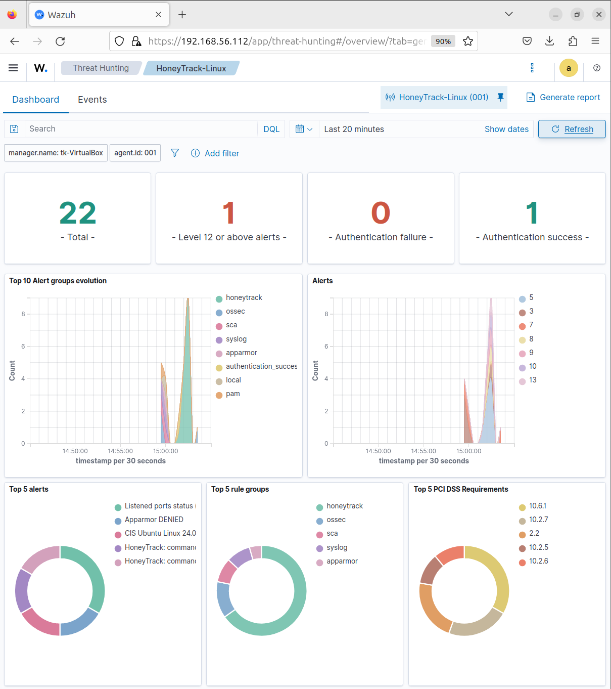

# Detection Catalog

Every detection rule in this lab, what it fires on, and why it carries the severity it does.

Rules live in [`../rules/local_rules.xml`](../rules/local_rules.xml) and are deployed to `/var/ossec/etc/rules/local_rules.xml` on the Wazuh manager.

---

## Severity model

Levels follow the attack lifecycle rather than being assigned ad hoc. The further an attacker gets, the louder the alert:

| Level | Meaning | Example |
|-------|---------|---------|
| 3 | Informational — session bookkeeping | Session opened / closed |
| 5–6 | Reconnaissance — attacker is looking around | Commands run, credentials tried |
| 8–9 | Staging — attacker is preparing something | Permission change, file drop, interpreter launch |
| 10 | Ingress / automation — payload arriving, or a script driving the session | Download attempt, brute force |
| 12 | Persistence — attacker is trying to stay | Cron modification |
| 13 | Correlated compromise — a multi-step sequence observed | Download followed by persistence |

Wazuh's dashboard buckets level 12 and above as critical, so persistence and kill-chain alerts surface immediately.

---

## Single-event rules

### 100100 — Base rule
**Level 3** · no ATT&CK mapping

```xml
<rule id="100100" level="3">
  <decoded_as>json</decoded_as>
  <field name="session_id">\w+</field>
  ...
</rule>
```

Matches any JSON event carrying a `session_id`, which uniquely identifies honeypot telemetry. Every other rule inherits from this one via `<if_sid>`, so the honeypot's event stream is isolated from the rest of the SIEM's traffic in a single place.

If an event reaches the dashboard tagged `100100`, it means the honeypot emitted an event type with no specific rule yet — a useful signal that the ruleset has fallen behind the honeypot.

### 100101 — Session opened
**Level 5** · T1078 Valid Accounts

Fires on `session_start`. The honeypot accepts any credentials, so a session opening means an attacker believed they had valid access.

### 100102 — Credential attempt
**Level 6** · T1110 Brute Force

Fires on `auth_attempt`, logged before a shell exists. Captures the username and password tried, which is useful threat intelligence in its own right — credential lists reveal which botnet or toolkit is in use.

### 100103 — Command executed
**Level 5** · T1059 Command and Scripting Interpreter

Fires on every `command` event. Deliberately low severity: on its own, a command is just noise. Its value is as raw material for `100121`, and as the searchable record of exactly what the attacker typed.

### 100104 — Ingress tool transfer
**Level 10** · T1105 Ingress Tool Transfer

Fires on `download_attempt` (`wget`, `curl`, `scp`, `tftp`). A significant escalation — the attacker is pulling external code onto the host. This is the first half of the kill chain in `100122`.

### 100105 — File dropped
**Level 9** · T1105 Ingress Tool Transfer

Fires on `file_drop`, which the honeypot raises for downloads, `touch`, and shell redirection. Records the filename, so payload naming conventions are preserved.

### 100106 — Permission modification
**Level 8** · T1222 File and Directory Permissions Modification

Fires on `permission_change` (`chmod`, `chown`, `chattr`). Almost always means a dropped file is being made executable — a strong staging signal.

### 100107 — Persistence attempt
**Level 12** · T1053 Scheduled Task/Job

Fires on `persistence_attempt` (`crontab`, writes under `/etc/cron*`). Critical severity: the attacker is establishing survival across reboots, which is the point where an intrusion becomes a foothold.

### 100108 — Privilege escalation via sudo
**Level 8** · T1548.003 Sudo and Sudo Caching

Fires on `privilege_escalation`, raised whenever `sudo` is invoked. The honeypot presents a root shell, so `sudo` is redundant — its use signals habit, tooling, or an attacker probing what they can do.

### 100109 — Interpreter execution
**Level 9** · T1059.004 Unix Shell

Fires on `interpreter_exec` (`bash`, `sh`, `python3`, `perl`). Frequently the moment a dropped payload is run.

### 100110 — Session closed
**Level 3** · no ATT&CK mapping

Fires on `session_end`, carrying session duration. Informational, but it bounds a session for timeline reconstruction and makes dwell time queryable.

---

## Correlation rules

These are the detections that distinguish this ruleset from simple field matching. They use Wazuh's `if_matched_sid`, `frequency`, and `timeframe` attributes, with `<same_field>peer_ip</same_field>` grouping events by attacker.

### 100120 — Brute force
**Level 10** · T1110 Brute Force · 5 events in 120 seconds

```xml
<rule id="100120" level="10" frequency="5" timeframe="120">
  <if_matched_sid>100102</if_matched_sid>
  <same_field>peer_ip</same_field>
  ...
</rule>
```

A single credential attempt is level 6. Five from one source inside two minutes is a brute-force campaign, and gets escalated accordingly.

### 100121 — Scripted attacker
**Level 10** · T1059 · 10 events in 60 seconds

Ten commands in a minute is faster than a human types. This rule distinguishes automated tooling from an interactive operator — a genuinely useful triage signal, since scripted attacks and hands-on-keyboard intrusions warrant different responses.

### 100122 — Kill chain
**Level 13** · T1105 + T1053 · download → persistence within 10 minutes

```xml
<rule id="100122" level="13" frequency="2" timeframe="600">
  <if_sid>100107</if_sid>                    <!-- this event is persistence -->
  <if_matched_sid>100104</if_matched_sid>    <!-- a download preceded it -->
  <same_field>peer_ip</same_field>
  <mitre>
    <id>T1105</id>
    <id>T1053</id>
  </mitre>
</rule>
```

The highest-value rule here. `if_sid` requires the current event to be persistence; `if_matched_sid` requires a download to have already occurred; `same_field` ties both to one attacker.

The result is a single alert carrying **two** techniques across **four** tactics — Command and Control, Execution, Persistence, and Privilege Escalation — describing a compromise sequence rather than isolated events. It supersedes the `100107` alert for the triggering event instead of duplicating it.

---

## Verification

Every rule was validated with `wazuh-logtest` before deployment, then confirmed live.

**Rule matching and ATT&CK enrichment:**

```
$ sudo /var/ossec/bin/wazuh-logtest
{"session_id":"t1","peer_ip":"203.0.113.9","event":"persistence_attempt","value":"crontab -e"}

**Phase 3: Completed filtering (rules).
    id: '100122'
    level: '13'
    description: 'HoneyTrack: kill chain - payload download followed by persistence from 203.0.113.9'
    mitre.id: '['T1105', 'T1053']'
    mitre.tactic: '['Command and Control', 'Execution', 'Persistence', 'Privilege Escalation']'
**Alert to be generated.
```

**Correlation thresholds** fired exactly at their configured counts — `100120` on the fifth credential attempt, `100121` on the tenth command.


**Live confirmation.** A single honeypot session running `sudo whoami`, `bash`, `wget`, `chmod +x`, and `crontab -e` produced `100101`, `100108` ×2, `100109`, `100104`, `100105`, `100106`, `100110`, and the `100122` kill chain — with no events falling through to the base rule.



---

## Known gaps

- **`cwd_change` has no dedicated rule.** It falls through to `100100` at level 3, which is the intended outcome — directory changes are context, not detections.
- **Correlation counters reset after firing.** A sustained attack produces one alert per threshold window rather than continuous alerting. Appropriate for a lab; a production deployment might want repeat escalation.
- **No Windows coverage yet.** The ruleset is Linux-only; Sysmon-based detections are on the roadmap.
- **Detections are honeypot-specific.** They key off HoneyTrack's JSON schema rather than generic system telemetry. Portable Sigma versions are on the roadmap.